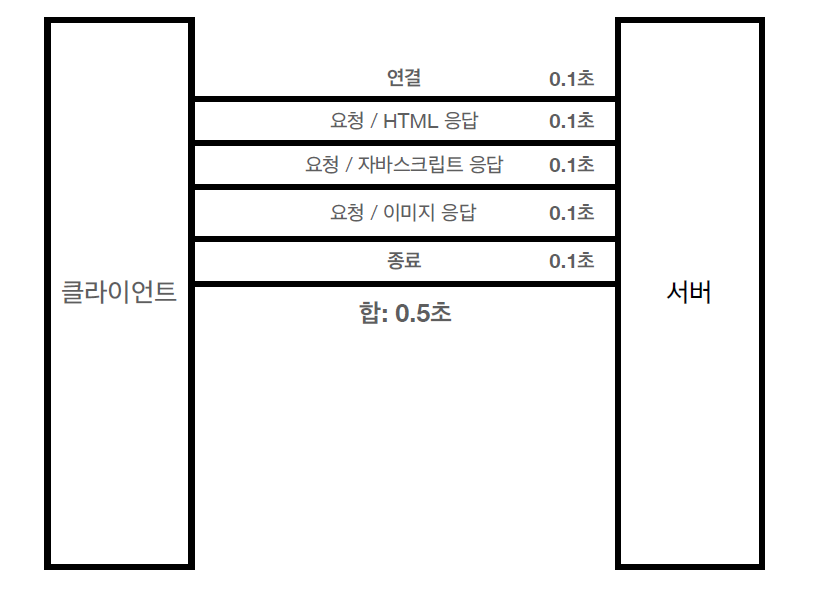

## HTTP로 통신하는 것들

- HTML, TEXT
- 이미지, 음성, 영상, 파일
- JSON, XML (API)
- 서버간에 데이터를 주고 받을때 등 거의 모든 형태의 데이터 전송이 가능

## 기반 프로토콜

- 현재는 HTTP/1.1을 주로 사용한다 (2, 3 사용률 점점 증가)


| TCP | UDP |
| --- | --- |
| HTTP/1.1, HTTP/2 | HTTP/3 |

## HTTP 특징

- 클라이언트 ↔ 서버 구조
- 무상태 프로토콜
- 비연결성

### 클라이언트 서버 구조

- Request ←→ Response
- 클라이언트는 서버에 요청을 보낸 후 응답을 대기 (응답 올 때까지 계속 대기)
- 서버가 요청에 대한 결과를 만들어서 응답

```markdown
💡 클라이언트와 서버를 분리를 하면 좋은 이유

	- 서버는 비지니스 로직 및 데이터 같은 복잡한 처리에 집중함
	- 클라이언트는 UI 및 사용성에 집중함

양쪽에서 독립적으로 진행할 수 있기 때문에 각각 독립적으로 진화가 가능하다!
(안드로이드, IOS, 웹 등 다양한 클라이언트 종류 대응 가능, 자유롭게 아키텍쳐 및 기술 변경 가능)
```

### 무상태 프로토콜(stateless)

- 서버가 클라이언트의 상태를 보존하지 않음


    | 장점 | 서버 확장성이 높음 (스케일 아웃) |
    | --- | --- |
    | 단점 | 클라이언트가 요청마다 추가 데이터를 매번 전송해야 함 |

```markdown
💡 예시를 들어보자!

나는 GS25에 가서 구운감자 3개를 신용카드로 계산할 것이다.

Stateful
나 : 구운감자 주세요
점원 : 몇개 드릴까요?
나 : 3개 주세요
점원 : 결제는 무엇으로 도와드릴까요?
나 : 신용카드로 할게요
점원 : 결제 완료되었습니다.

Stateless
나 : 구운감자 주세요
점원A : 몇개 드릴까요?
나 : 3개 주세요
점원B : 무엇을 3개를 줘야하나요??
나 : 신용카드로 구매할게요
점원C : 무엇을 몇개 신용카드로 구매하시나요?

-> **구운감자 3개**를 **신용카드로 구매**할게요

이처럼 무상태는 요청마다 필요한 데이터를 모두 보내야 한다
따라서 응답 서버를 쉽게 교체할 수 있다 (요청마다 점원이 계속 바뀌어도 상관이 없음)
→ 무한한 서버 증설이 가능
```

- 모든 것을 무상태로 설계 할 수 있는 경우도 있고 없는 경우도 있다
    - 무상태로 설계할 때 : 로그인이 필요 없는 단순한 서비스 소개 화면
    - 상태 유지로 설계할 때 : 로그인한 사용자의 경우는 로그인한 상태가 서버에 유지되어야 함
        - 일반적으로는 브라우저 쿠키 및 서버 세션등을 사용해서 상태 유지를 함
        - 상태 유지는 꼭 필요한 경우에만 최소한으로 사용하는게 좋음

### 비연결성

- HTTP는 기본이 연결을 유지하지 않는 모델
- 일반적으로 응답속도는 초 단위 이하이다
- 수천명이 서비스를 사용해도 실제 서버에서 동시에 처리되는 요청은 매우 작다
- 따라서 요청 후 응답을 한 뒤 연결을 바로 끊어야 서버 자원을 매우 효율적으로 사용이 가능하다

    ```markdown
    html 문서를 주고받는 환경에서는 바로바로 요청을 하지 않는다 (화면 보는 시간)
    -> 연결이 유지되지 않는게 서버 입장에서는 자원의 가용성을 높일 수 있다
    ```


단점

- TCP/IP 연결을 매번 새로 맺어야 함 → 3 way handshake 시간 추가
- 웹 브라우저로 사이트를 요청하면 HTML, CSS, JS, 이미지 등 수 많은 자원이 함께 다운로드가 됨
- 이러한 문제들을 HTTP **지속 연결(Persistent Connections)** 로 해결하였음

지속 연결(Persistent Connections)

- 3 way handshake로 연결을 한 후, 요청과 응답이 이루어지고 바로 연결을 끊지 않음
- 내부 매커니즘을 통해 한 화면의 요청이 끝날때까지 연결을 유지한다
- 이미지 응답까지 다 완료 되고 연결 종료





### HTTP 메시지

- HTTP 의 메시지 구조는 크게 네가지 영역으로 구분됩니다

```markdown
start-line : 시작라인
header : 헤더

empty line : 공백라인 (CRLF) ※ 필수

message body : 바디라인
```

`📢 요청메시지와 응답 메시지는 시작라인(start-line)만 서로 다르고 나머지 부분은 동일합니다!!`

요청 메시지 (request-line)

```markdown
GET /giibeom?tab=repositories HTTP/1.1
Host: www.github.com
```

- 시작 라인 (start-line)
    - method path HTTP-Version
        - method : GET, POST, PUT, PATCH, DELETE


            | GET | 리소스 조회 |
            | --- | --- |
            | POST | 요청 내역 처리 |
        - path : 절대경로[?쿼리파라미터]
            - “/” 로 시작하는 경로가 절대경로이다
        - HTTP-Version : 1.1, 2, 3 등등

응답 메시지 (status-line)

```markdown
HTTP/1.1 200 OK
content-type: text/html; charset=utf-8
Content-Length: 34233

<html>
<body>...</body>
</html>
```

- 시작라인 (start-line)
    - HTTP-Version 상태코드 이유문구
        - HTTP-Version : 1.1, 2, 3 등등
        - 상태코드 : 응답 상태를 코드로 나타낸다


            | 2xx | 성공 |
            | --- | --- |
            | 4xx | 클라이언트 요청 오류 |
            | 5xx | 서버 내부 오류 |
        - 이유문구 : 상태 코드를 사람이 이해할 수 있게 하는 짧은 설명 글이다

헤더 (header)

- filed-name: (OWS)field-value(OWS)
    - OWS는 띄어쓰기 허용한다는 의미이다
- HTTP 전송에 필요한 모든 부가 정보이다

    ```markdown
    ex)
    content-type: text/html; charset=utf-8
    Content-Length: 34233
    cache-control: max-age=0, private, must-revalidate
    content-encoding: gzip
    date: Sun, 19 Jun 2022 02:37:41 GMT
    ```

- 필요 시 임의의 헤더 추가도 가능하다


바디 (message body)

- 실제 전송할 데이터이다
- HTML 문서, 이미지, 영상 JSON 등의 byte로 표헌할 수 있는 모든 데이터를 전송할 수 있다